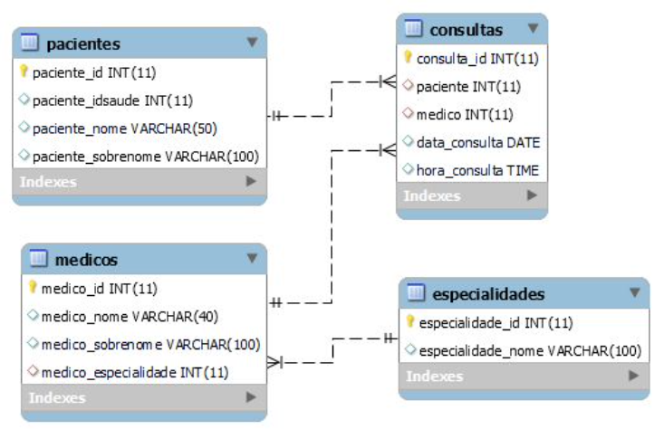

# **Consultório Saúde DH II**

## **Enunciado**

O consultório atende pacientes que possuem
número de identificação de saúde e, além disso,
precisam registrar nome e sobrenome.

Cada paciente tem uma consulta agendada,
com dia e horário acertados com o médico.

Além disso, cada médico deve ser registrado,
com nome, sobrenome e especialidade.

### **Enunciado**

Sabemos que o paciente é atendido no plantão com apenas um médico.

E também que os médicos podem atender vários pacientes em sua jornada de
trabalho.

O Departamento de Saúde DH deseja registrar o atendimento aos pacientes, a
fim de ser capaz de gerenciar corretamente os turnos, médicos e pacientes
designados.

****Diagrama Entidade Relacionamento****

### **Orientação**

Com o MySQL Workbench, vamos criar
nosso banco de dados usando o modelo
do slide anterior.

Depois que o banco de dados for criado,
usaremos a engenharia reversa para
validar nosso modelo.